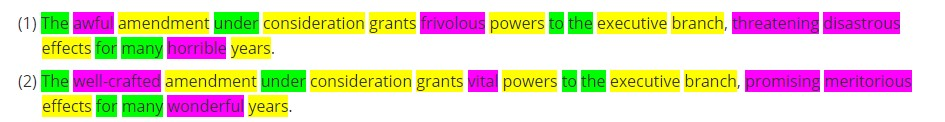

# Sentiment-analsysis-using-sentiment-words-dictionaries
Use positive and negative sentiment words dictionaries to predict rating of an Hotel

# Definition of sentiment analysis

Sentiment analysis provides the opinion expressed in a text.
Let's consider an example with the 2 sentences below.
- function words are highlighted in green and content words in yellow.
- There is a third kind of word here, highlighted in purple: sentiment words.

In this example, the two sentences are dealing with the same topic: There is a piece of legislation in congress that would let one branch of government carry out a new authority. But the opinion expressed in (1) is negative while the opinion in (2) is positive. This difference is **sentiment analysis**.

If we look at the topic of these sentences, we would see exactly the **same content**, characterized by the content words in yellow. If we looked at the form of these sentences, we would see exactly the **same function words**, highlighted in green. The only difference between these two sentences is the **sentiment words** colored in purple.

# Dataset

The dataset comprises ratings (High or Low) for more than 5000 hotels.For each hotel, the rating is the average over multiple customer ratings available in the dataset. A small part of these evaluations are even in foreigh languages including Japanese !

# Approach

The text from the customer reviews will be used to determine the sentiment.
The positive and negative words from the pre-defined dictionary will provide the dimensions when reviews are converted into numeric vectors for sentiment analysis.

# Results

The model generalizes very well as the accuracy reached on 530 unseen hotels is 100%.
By counting positive and negative words in reviews for a new hotel, the model is able to correctly predict the average sentiment for this hotel. The performance can be explained by the fact we feed the model with a large enough set of reviews allowing to clearly come up with higher positive or negative counts. In-between positions, ambiguous evaluations, get outnumbered by the majority remaining.
